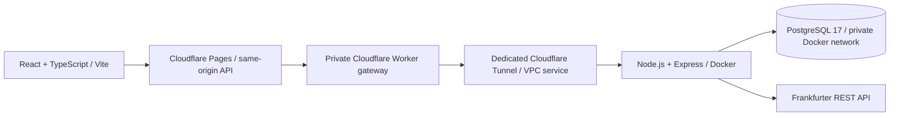

# Atlas Operations — Full-Stack API / Debugging Dashboard

**[Open the live demo](https://fullstack-api-dashboard-demo.pages.dev/)** · **[GitHub repository](https://github.com/ScorpionD/fullstack-api-dashboard-demo)** · [API reference](docs/api.md) · [Debugging casebook](docs/debugging.md)

A full-stack operations dashboard for service businesses and sales teams. Manage customers and orders, inspect completed revenue, follow an audit trail and see how a real external API integration handles failure.

Built as a portfolio demo to showcase production-style full-stack development, API integration and troubleshooting. The interface uses a real Node.js API and PostgreSQL database. Business records and revenue are fictional; each visitor receives an isolated workspace.


[View the screenshots](#screenshots) · [What this project demonstrates](#what-this-project-demonstrates) · [Architecture](#architecture) · [Local setup](#local-development) · [Docker](#docker-deployment) · [Deployment](#cloudflare-pages-deployment)

## A quick tour

1. Choose **Admin** and select **Enter workspace**. The public demo credentials are prefilled.
2. Open **Customers**, create a test customer and edit their company. Try a search or status filter.
3. Create an **Order**, update its status, then inspect **Audit log** for the action, actor, role, timestamp and changed fields.
4. In **Integration lab**, run **Normal response**, then **Simulate a timeout** and **Simulate a bad response**. Every result identifies whether it is fresh, cached, a fallback or unavailable.
5. Open **Debugging cases** for five Bug → Root cause → Fix examples with direct fix-commit links. **Architecture** explains the connected stack and recorded verification results.
6. Sign out and enter as **Viewer** to inspect read-only access. A new login starts a new isolated workspace.

## What this project demonstrates

| Capability | Evidence in the working application |
| --- | --- |
| Full-stack development | Responsive React/TypeScript UI connected to an Express API and persistent database |
| REST API design | Consistent JSON contracts, CRUD, pagination, search, status filters and actionable errors |
| PostgreSQL data modeling | Users, sessions, isolated workspaces, customers, orders and transactional audit records |
| Authentication and roles | Server-side session expiry, admin/viewer authorization, CSRF and origin checks |
| Error handling | Loading completion, retry without losing form data, validation feedback and explicit fallback states |
| External API integration | A real Frankfurter REST adapter with checked payloads, timeouts, caching and one bounded retry |
| Debugging | Five preserved regression/fix histories with reproducible tests and source links |
| Testing | Contract and React tests, actual PostgreSQL API tests, public API verification and responsive browser checks |
| Deployment | Cloudflare Pages, a protected Worker gateway and an isolated Docker API/database deployment |

## Debugging showcase

These are intentional engineering exercises with reproducible failures, not claims about client incidents. The final `main` branch contains corrected code. Git history has not been rewritten.

| Bug | Root cause | Fix |
| --- | --- | --- |
| Missing customer/amount fields | Database and UI contracts use different names and units | [Explicit response mapping](https://github.com/ScorpionD/fullstack-api-dashboard-demo/commit/55ac1f6) |
| Expired token accepted | Authentication checked existence without expiry | [Validate expiry on every request](https://github.com/ScorpionD/fullstack-api-dashboard-demo/commit/44801a3) |
| Loading never finishes on error | Rejected request leaves loading active | [Complete error state and support retry](https://github.com/ScorpionD/fullstack-api-dashboard-demo/commit/0baa71c) |
| Filtered page appears empty | Page offset belongs to the old result set | [Reset/clamp pagination](https://github.com/ScorpionD/fullstack-api-dashboard-demo/commit/05110df) |
| Invalid order amount accepted | Coercion bypasses the monetary contract | [Positive bounded integer validation](https://github.com/ScorpionD/fullstack-api-dashboard-demo/commit/072c732) |

See [docs/debugging.md](docs/debugging.md) for regression checks, exact fix commits and safe reproduction instructions.

## Explore the demo

Choose **Admin** or **Viewer** on the login screen, then select **Enter workspace**. The credentials shown by those buttons are intentionally public demo accounts. They grant no access to real customer data, infrastructure or other visitors' workspaces.

| Account             | Public demo password | Access                                                    |
| ------------------- | -------------------- | --------------------------------------------------------- |
| `admin@atlas.demo`  | `DemoAdmin2026!`     | Read, create, edit, delete, audit log                     |
| `viewer@atlas.demo` | `DemoViewer2026!`    | Read-only customer, order, overview and integration views |

Each login creates an isolated workspace containing 24 fictional customers and 48 orders. A secure server session survives page reloads for up to 8 hours. Workspace data expires after 24 hours; cleanup runs hourly and on login. Public capacity is bounded to 200 workspaces, 100 customers and 200 orders per workspace. No private business data should be entered.

## What works

- Responsive operations overview with live revenue totals, order status distribution and a 28-day revenue chart.
- Customer and order CRUD, search, status filters, pagination and duplicate checks.
- Admin/viewer permissions enforced by the API, not only by disabled buttons.
- Opaque session tokens stored as hashes in PostgreSQL; HttpOnly/Secure/SameSite cookies in production, expiry checks, logout invalidation, CSRF tokens and origin validation.
- Strict input schemas, integer monetary amounts, bounded request sizes, centralized JSON errors, per-request IDs and structured metadata logging.
- Create/update/delete and the corresponding before/after audit record are committed in one transaction.
- Explicit workspace scoping and a composite foreign key prevent orders from referencing another visitor's customer.
- A real **Frankfurter REST API** adapter validates EUR/USD/GBP reference rates. Successful results are cached for 15 minutes. Timeouts and malformed data produce an explicit fallback to the last verified response, or an honest unavailable state when no verified data exists.
- Request-scoped timeout/bad-response simulations demonstrate the adapter's recovery path without altering global settings or deploying broken code. These simulations are clearly labelled.
- Loading, empty, error, retry, modal validation, deletion confirmation and toast states; stale request cancellation prevents outdated results replacing a newer view. Empty searches can be reset in one action; customer-option retries preserve an unfinished order form.
- Customer and order tables become labelled record cards on narrow screens, keeping edit/delete controls visible. Inputs, modal controls and primary actions use touch-friendly sizing.
- Audit entries expose the action, entity, user/role, timestamp and changed field names. The overview shows recent changes for admins; viewers cannot request the protected audit endpoint.
- Five documented debugging cases with reproducible regression tests and separate Git history. See [debugging casebook](docs/debugging.md).

The application uses fictional data and production-style engineering patterns. It is not a payment system, financial advice service or a production SLA offering. Rates are informational; orders always remain in EUR. There is no claim of real commercial revenue or customer adoption.

## Architecture



The backend/database use a separate Compose project, network and volume. Production PostgreSQL has no published host port. The API binds only to loopback on the host and requires a secret gateway header; the tunnel also reaches it through its isolated Docker network. The Worker has no public workers.dev address and is called through a Pages service binding. It strips untrusted forwarding headers, enforces size/origin/rate limits and injects the private origin secret. The runtime database role has no superuser, role-creation or database-creation privileges. Existing projects and DNS are not part of this deployment.

## Local development

Requirements: Node.js 22.12+ and Docker with Compose 2.24+.

```sh
npm ci
cp .env.example .env
# Replace POSTGRES_PASSWORD and APP_DB_PASSWORD with different random values.
# Update DATABASE_URL and TEST_DATABASE_URL to match those values.
docker compose up -d db
```

Database commands need environment variables loaded. Node's built-in env-file loader works without another dependency:

```sh
node --env-file=.env server/migrate.mjs
npm run dev:api
# In a second terminal:
npm run dev
```

Open `http://localhost:5173` (the default allowed local origin). Vite proxies `/api` to the local API. Alternatively run `docker compose up -d --build` for both the API and database, and use `npm run dev` for the frontend. The base Compose publishes only loopback ports 4100 and 55441. The database initialization script creates the restricted application role on a new volume; changing an env password does not automatically rotate an existing database role.

## Tests and build

```sh
docker compose exec db createdb -U dashboard dashboard_test
# TEST_DATABASE_URL must explicitly target the separate dashboard_test database.
npm test
npm run lint
npm run build
npm audit --audit-level=moderate
```

`npm test` includes actual PostgreSQL API tests; it deliberately fails if the separate test database is not configured. `npm run test:unit` runs contract and React tests without a database. CI provisions its own temporary PostgreSQL service and runs the full suite and production build. Coverage includes authentication/expiry, CSRF, viewer restrictions, CRUD/audit consistency, cross-workspace protection, search, filtering, pagination, validation, external adapter failures and frontend recovery. Debugging reproduction branches are expected to fail selected regression checks.

`npm run lint` currently performs strict TypeScript checking, not a separate ESLint ruleset. This is named explicitly so the verification scope is clear.

## Docker deployment

1. Place the repository in its own directory and create a private `.env` with independent database passwords, `NODE_ENV=production`, `TRUST_PROXY=true`, the production `PUBLIC_ORIGIN` and a random 32-byte `ORIGIN_SECRET`.
2. Create a dedicated Cloudflare Tunnel and HTTP VPC service targeting the API service on port 4100. A container-network hostname such as `api` can be resolved through the tunnel. Do not expose PostgreSQL or add unrelated DNS routes.
3. Save the tunnel token in `secrets/tunnel-token.txt` readable by cloudflared's container UID, and run:

```sh
docker compose -f compose.yaml -f compose.production.yaml up -d --build
docker compose -f compose.yaml -f compose.production.yaml ps
```

The production override disables database port publication. All containers have memory/CPU/PID limits; the API uses a non-root user, a read-only filesystem, dropped capabilities and no-new-privileges. Logs rotate. Schema setup and seed-user initialization are reproducible and serialized with a database lock. Named volumes persist across restarts. Back up the dedicated PostgreSQL volume before making schema changes. Do not run volume removal against a workspace whose data you need to retain.

## Cloudflare Pages deployment

- GitHub repository: `ScorpionD/fullstack-api-dashboard-demo`
- Production branch: `main`
- Build command: `npm run build`
- Build output: `dist`
- Node version: 22
- Deploy `worker/index.mjs` using `worker/wrangler.jsonc` after configuring the deployment's private VPC service binding.
- Store the matching `ORIGIN_SECRET` as a Worker secret. Bind the Worker to Pages production as `DASHBOARD_API`.
- Preview branches must not receive production API access; the gateway accepts only the production origin.

The Cloudflare GitHub App is authorized for this repository, with access limited to selected repositories. Automatic production deployment after a push to `main` was verified successfully on 11 September 2026; preview deployments are disabled. The existing project, production API service binding and live URL are retained. Confirm each deployment's successful status and matching commit SHA in Cloudflare; the [verification record](docs/verification.md) includes the verified commit and deployment.

No secret has a `VITE_` prefix. `.env`, tunnel credentials and deployment configuration secrets are ignored by Git and excluded from the Docker build. Public demo passwords are intentionally separate from real server/database credentials.

## API documentation

See [REST API reference](docs/api.md), [debugging casebook](docs/debugging.md) and [verification record](docs/verification.md).

## Screenshots

Eight actual production screenshots, captured on 11 September 2026 after live verification, plus a separate **1280 × 960 portfolio cover**. All customer and revenue data is fictional demo data. The cover combines a real application screenshot with project text; the eight screens are direct browser captures.

| Screen | What it demonstrates |
| --- | --- |
| [01 — Login / role selection](docs/screenshots/01-login-role-selection.jpg) | Clear Admin/Viewer entry and public demo credentials |
| [02 — Dashboard overview](docs/screenshots/02-dashboard-overview.jpg) | Business KPIs, revenue chart, order status and recent activity |
| [03 — Customers](docs/screenshots/03-customers.jpg) | Search, filters, pagination and record actions |
| [04 — Edit order](docs/screenshots/04-edit-order.jpg) | Validated customer, amount and status form |
| [05 — Audit log](docs/screenshots/05-audit-log.jpg) | Six real CRUD events with actor, role, timestamp and change summary |
| [06 — Integration lab](docs/screenshots/06-integration-lab.jpg) | Simulated bad response and explicitly identified verified fallback |
| [07 — Debugging showcase](docs/screenshots/07-debugging-showcase.jpg) | Five documented Bug → Root cause → Fix cases |
| [08 — Architecture / features](docs/screenshots/08-architecture-features.jpg) | Connected stack, security patterns and verified test results |

[Open the full gallery](docs/screenshots/README.md) · [Download the cover](docs/screenshots/00-cover.jpg)

Additional verification captures: [mobile login](docs/screenshots/mobile-login.jpg) · [mobile overview](docs/screenshots/mobile-overview.jpg) · [mobile customers](docs/screenshots/mobile-customers.jpg) · [mobile order form](docs/screenshots/mobile-order-form.jpg) · [Viewer restrictions](docs/screenshots/viewer-access.jpg).

## Release verification

47 automated checks pass, including real PostgreSQL API tests. Strict TypeScript checking and the production build pass; the dependency audit reports 0 known vulnerabilities at verification time. Public API verification passes all 14 groups. Browser checks cover eight views at 320, 390, 768 and 1440 px (32 layouts), plus four edit-modal sizes, with no page-level horizontal overflow. Admin/Viewer permissions, CRUD, audit, page reload and external fallback were exercised through the live UI. See the [verification record](docs/verification.md) for dates, scope and limitations. Run `npm run smoke:production` only when you intend to exercise the public demo; it creates its own isolated test workspace and does not use infrastructure credentials.

## Technology

React 19 · TypeScript · Vite · Node.js 22 · Express 5 · Zod · PostgreSQL 17 · Docker / Compose · Cloudflare Pages / Workers / Tunnel · Frankfurter REST API · Vitest · Testing Library · Supertest · GitHub Actions.

External provider documentation: [Frankfurter API](https://frankfurter.dev/v1/). Private connectivity uses [Cloudflare Workers VPC](https://developers.cloudflare.com/workers-vpc/configuration/vpc-services/), currently available without charge during beta; commercial capacity and future provider pricing require separate review. No paid service was intentionally enabled for this demo.
