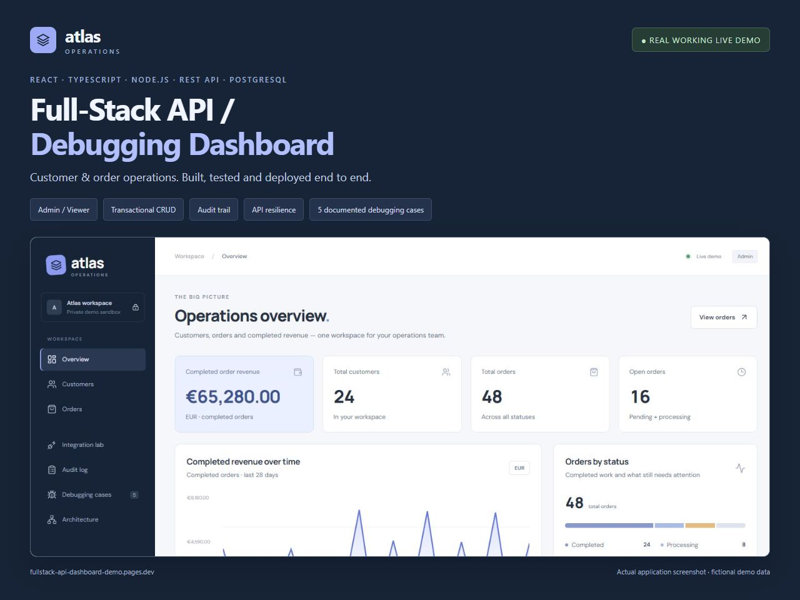
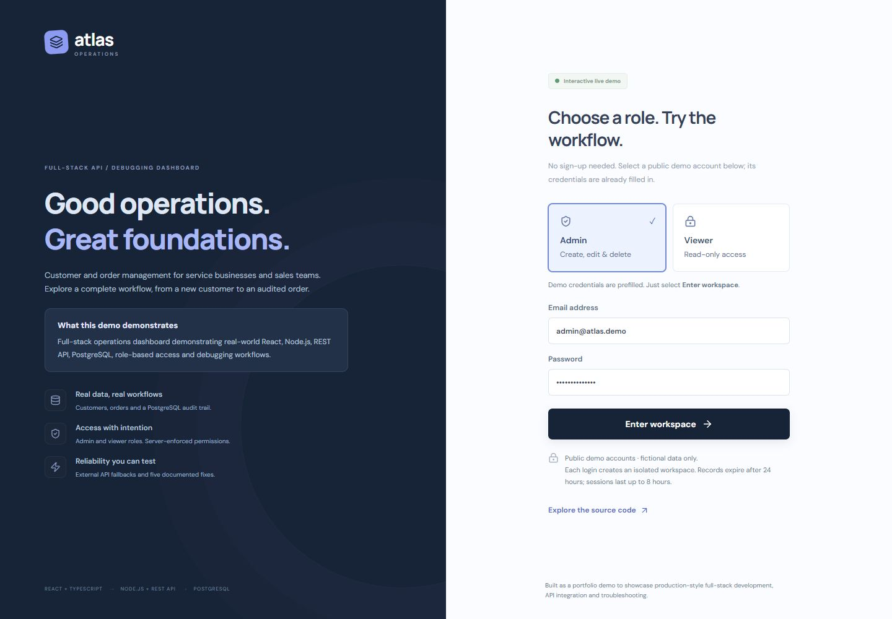
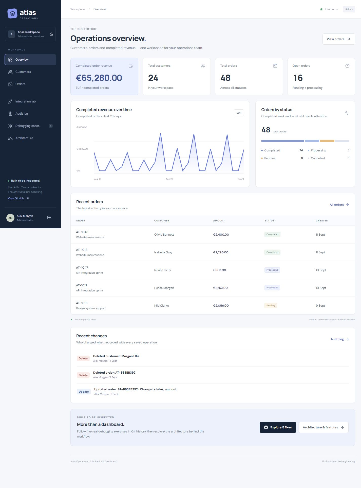
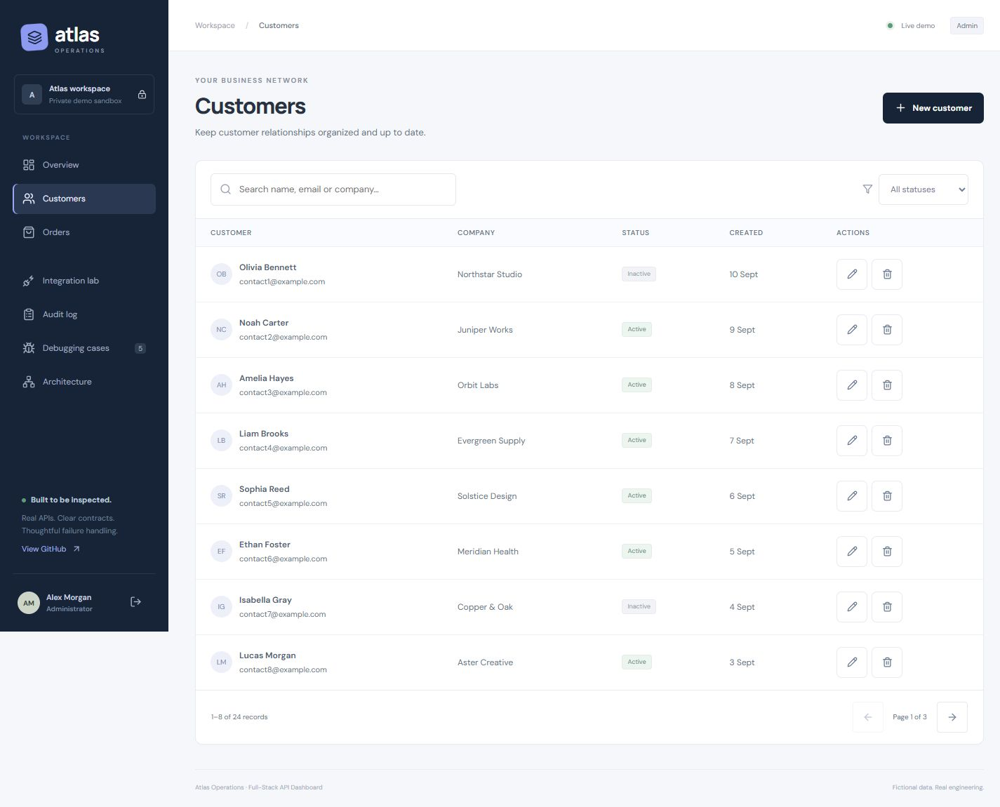
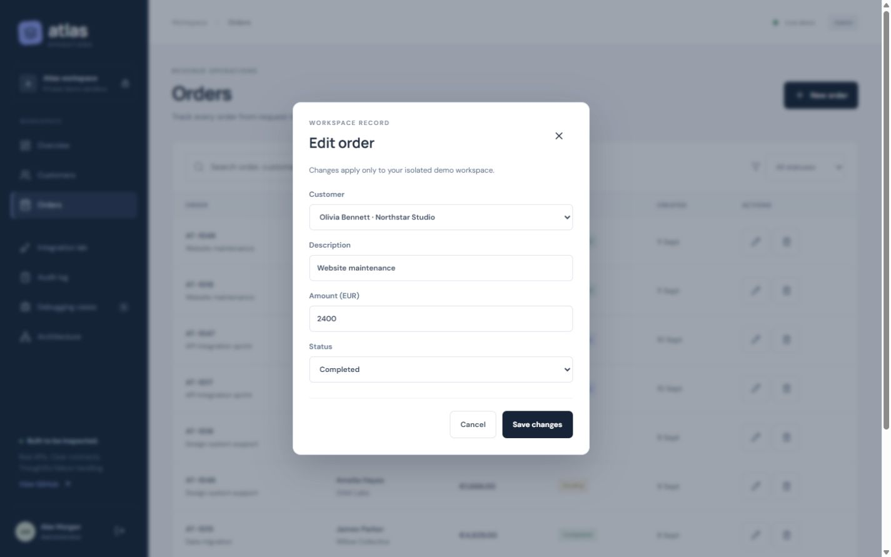
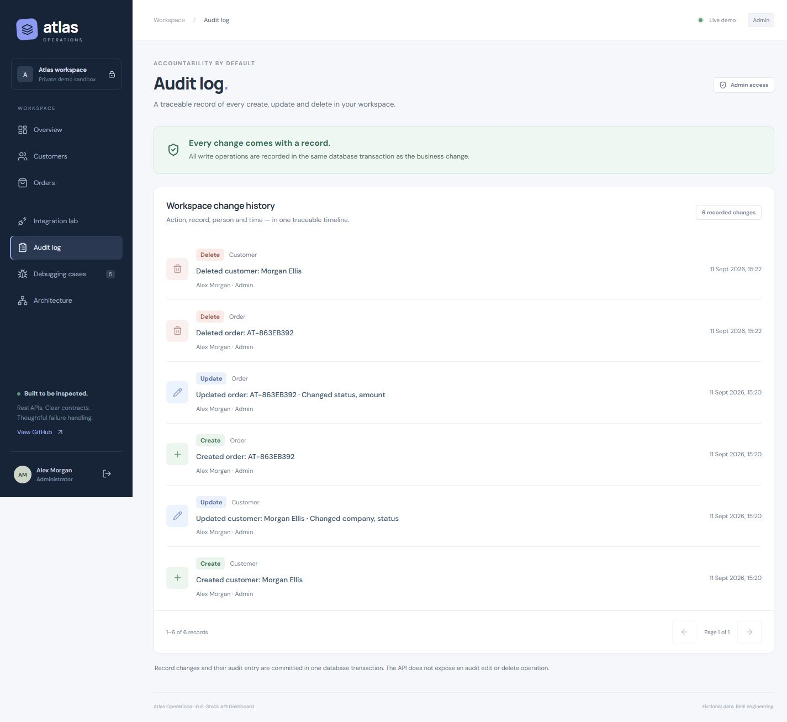
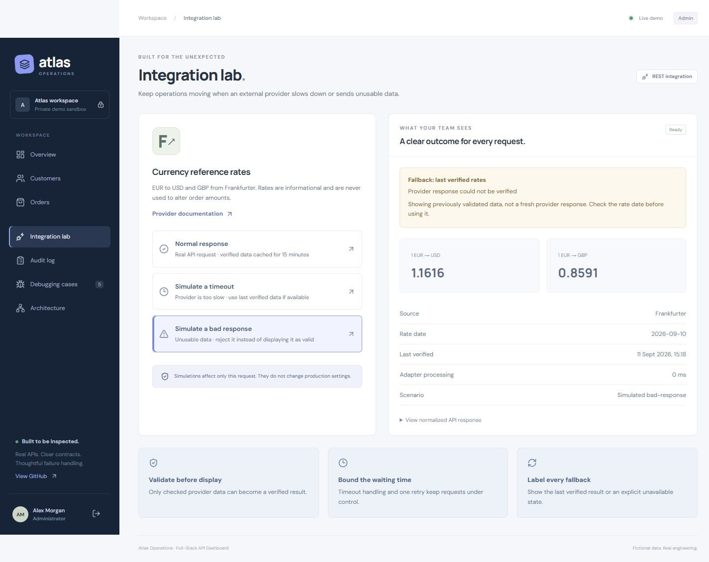
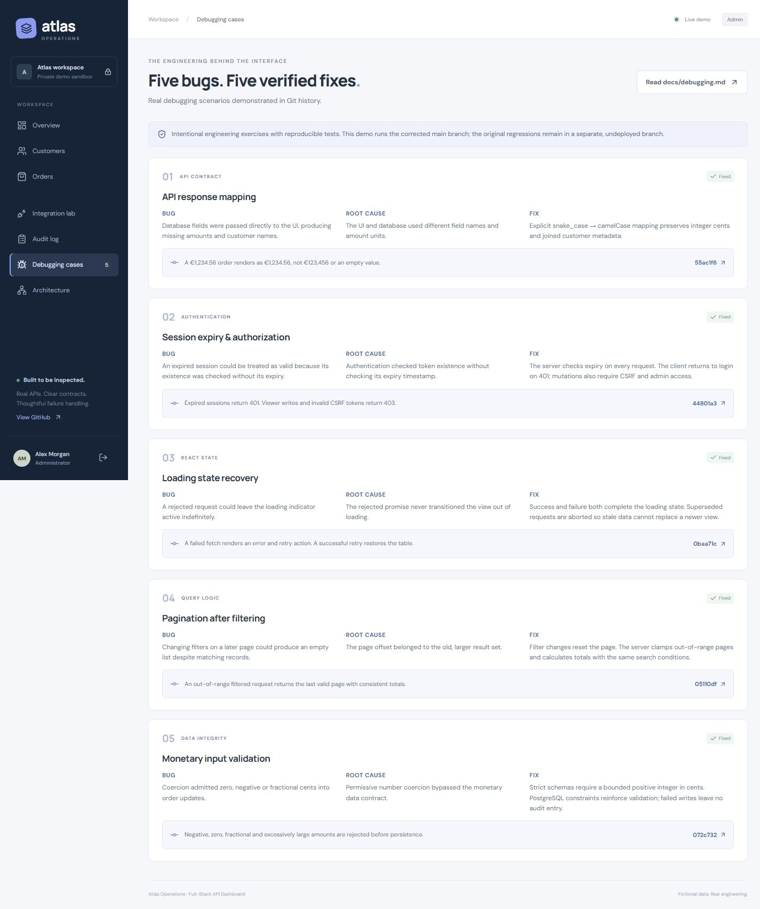
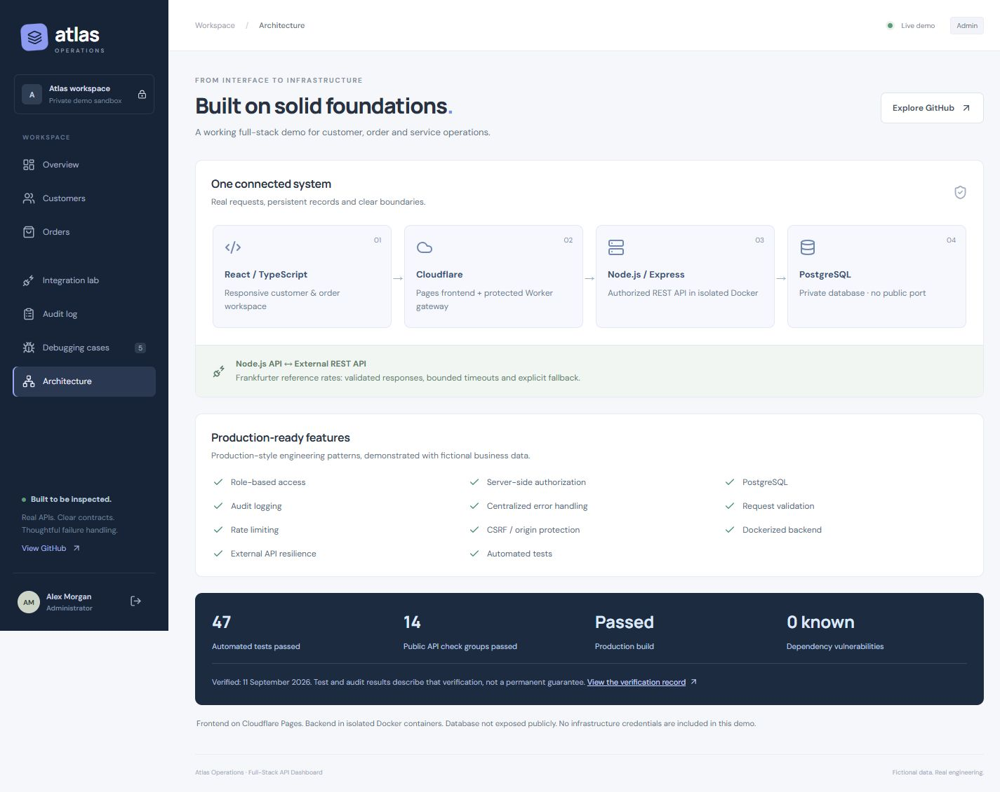

# Portfolio media

[Live demo](https://fullstack-api-dashboard-demo.pages.dev/) · [Repository](https://github.com/ScorpionD/fullstack-api-dashboard-demo) · [Verification record](../verification.md)

Captured from the deployed application on 11 September 2026. The business data is fictional. These screenshots show working UI connected to the real API/database, not mockups. They contain no private infrastructure settings. JPEG originals are available through each image link.

## Cover — 1280 × 960

A separate 4:3 portfolio cover combining project text with a real production dashboard capture.

## 01 — Login and role selection

Admin/Viewer permissions, a clear entry CTA and intentionally public demo credentials.

## 02 — Dashboard overview

Completed revenue, customer/order totals, status breakdown, recent orders and actual audit activity.

## 03 — Customer operations

Search, status filters, pagination and record actions in an isolated demo workspace.

## 04 — Edit order

The real edit form with customer selection, description, monetary amount and status.

## 05 — Transactional audit trail

Six actual create/update/delete events from the verified customer/order scenario. Actor, role, time and changed fields remain visible after the test records are deleted.

## 06 — External API resilience

The intentionally simulated malformed response is labelled; the result explicitly identifies last-verified fallback data and its freshness.

## 07 — Debugging casebook

Five intentional engineering exercises, each with Bug → Root cause → Fix and its preserved commit link. The deployed code contains the fixes.

## 08 — Architecture and verified features

Connected frontend, protected gateway, Node.js API and private PostgreSQL database; external API access originates at the backend. Test results are dated verification facts.

## Additional QA captures

- [Mobile login](mobile-login.jpg)
- [Mobile overview](mobile-overview.jpg)
- [Mobile customer cards](mobile-customers.jpg)
- [Mobile order form](mobile-order-form.jpg)
- [Viewer read-only access](viewer-access.jpg)

The older `desktop-overview.png` and `integration-fallback.png` files are retained as historical baseline captures; the numbered files above are the current portfolio set.
